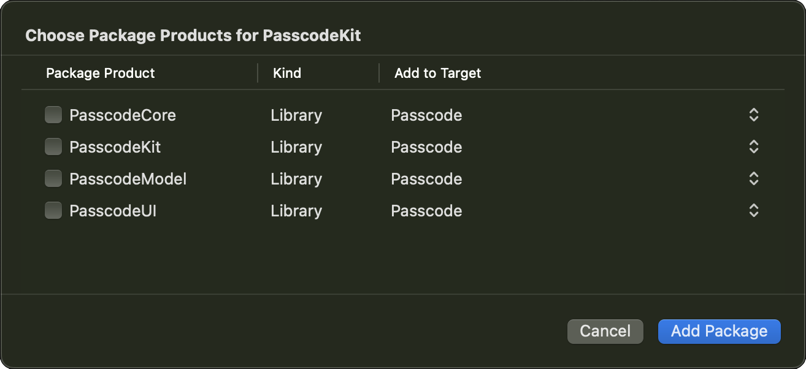

# PasscodeKit

[](https://swiftpackageindex.com/divadretlaw/PasscodeKit)
[](https://swiftpackageindex.com/divadretlaw/PasscodeKit)

Easily add a passcode to your iOS app

## Usage

PasscodeKit is split into several modules and depending on what you need you can use different or multiple modules.

### PasscodeKit

The most complete, but also less customizable, module. Simply add `.passcode()` to your root view.

```swift
@main
struct MyApp: App {
    var body: some Scene {
        WindowGroup {
            ContentView()
                .passcode()
        }
    }
}
```

The passcode has to be setup by the user in order to be used, you can add this modifier to any view to start the setup.

```swift
.setupPasscode(isPresented: $setupPasscode, type: .numeric(6))
```

To remove the passcode again, use the environment variables to access the Keychain and key used to store the passcode. You can also set these environment variables to override the used Keychain instance and key where the key that is used to store the data.

```swift
@Environment(\.passcodeKey) private var passcodeKey
@Environment(\.passcodeKeychain) private var passcodeKeychain
```

Then simply remove the entry for the passcode

```swift
passcodeKeychain.delete(passcodeKey)
```

### PasscodeCore

The core module, that handles displaying the passcode window. By default it has no UI to enter a passcode or setting up and storing the passcode, but you can use this to implement your own passcode UI.

```swift
.passcode(mode: PasscodeMode) { dismiss in
    // some Passcode input UI
} background: {
    // some optional background
}
```

### PasscodeUI

The UI used in `PasscodeKit` without dependencies on `PasscodeCore` and `PasscodeKit`

#### Localization

Customize / Localize the `PasscodeUI` by providing a `Passcode.strings` file in your main app bundle. See the default [Passcode.strings](Sources/PasscodeUI/Resources/Passcode.strings) file for English Strings.

## Installation

### Xcode

Add the following package URL to Xcode

```
https://github.com/divadretlaw/PasscodeKit
```

Select the module(s) you need



### Swift Package Manager

```swift
let package = Package(
    dependencies: [
        .package(url: "https://github.com/divadretlaw/PasscodeKit.git", from: "0.2.0"),
    ],
    targets: [
        .target(
            name: <#Target Name#>,
            dependencies: [
                .product(name: "PasscodeKit", package: "PasscodeKit")
            ]
        )
    ]
)
```

## License

See [LICENSE](LICENSE)
